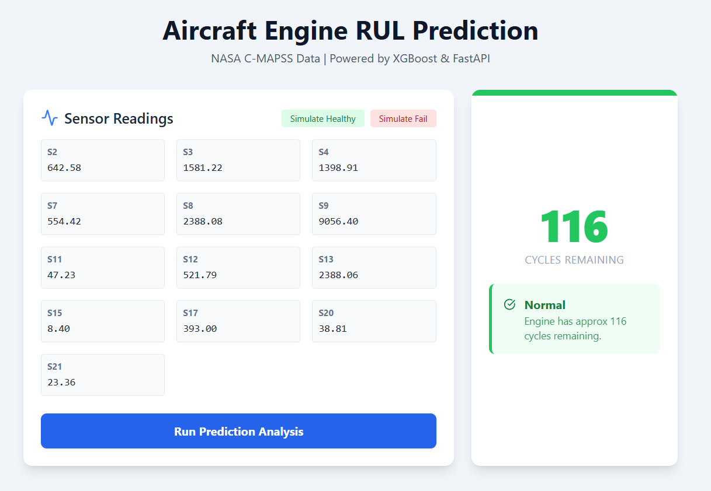
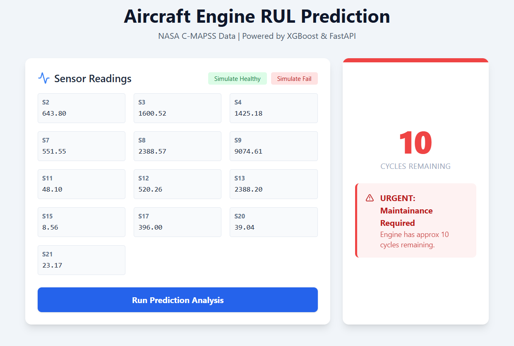

# Predictive Maintenance Dashboard for Aircraft Engines


An Machine Learning application that predicts the **Remaining Useful Life (RUL)** of turbofan engines using sensor data. This solution enables **proactive maintenance**, helping engineers identify potential failures before they occur.

---

## Demo Preview

The dashboard provides real-time health monitoring with visual alerts based on RUL predictions.

| Normal State (Safe) | Urgent State (Action Required) |
| :---: | :---: |
|  |  |
| *Engine is healthy with >50 cycles remaining.* | *Critical warning! Less than 30 cycles remaining.* |

---

## Key Features
* **Accurate Prediction:** Uses an **XGBoost Regressor** trained on NASA C-MAPSS data (RMSE: 16.78).
* **Real-time Dashboard:** Interactive UI built with **React** and **Tailwind CSS**.
* **Simulation Mode:** Built-in tool to simulate "Healthy" vs. "Failing" sensor data for demonstration.
* **Robust Backend:** **FastAPI** service handling data validation and model inference.

---

* **Dataset:** NASA C-MAPSS (FD001) - Turbofan Engine Degradation Simulation.
* **Preprocessing:** Correlation analysis, Constant feature removal, 
RUL Clipping (Threshold: 125).
* **Model:** XGBoost Regressor (Benchmark winner vs. Random Forest & Decision Tree).
* **Performance:**
    * **RMSE:** 16.78 cycles
    * **$R^2$ Score:** ~82%

## 📂 Project Structure
```text
predictive-maintenance-engine/
├── 📁 backend/              # FastAPI server & Model artifacts (.joblib)
├── 📁 frontend/             # React application source code
├── 📁 notebooks/            # Jupyter notebooks for EDA & Training
├── 📁 screenshots/          # Images for documentation
└── README.md                # Project documentation

```
cd backend
python -m venv venv
# Windows:
.\venv\Scripts\activate
# Mac/Linux:
source venv/bin/activate

pip install -r ../requirements.txt
uvicorn main:app --reload
```
